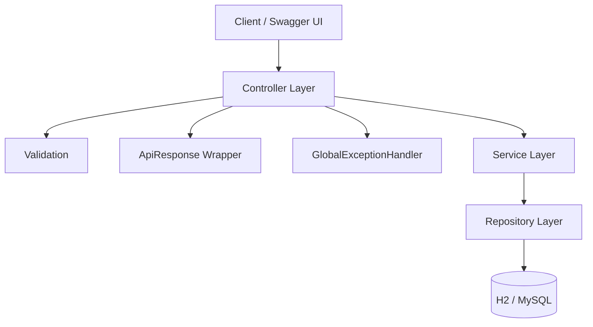
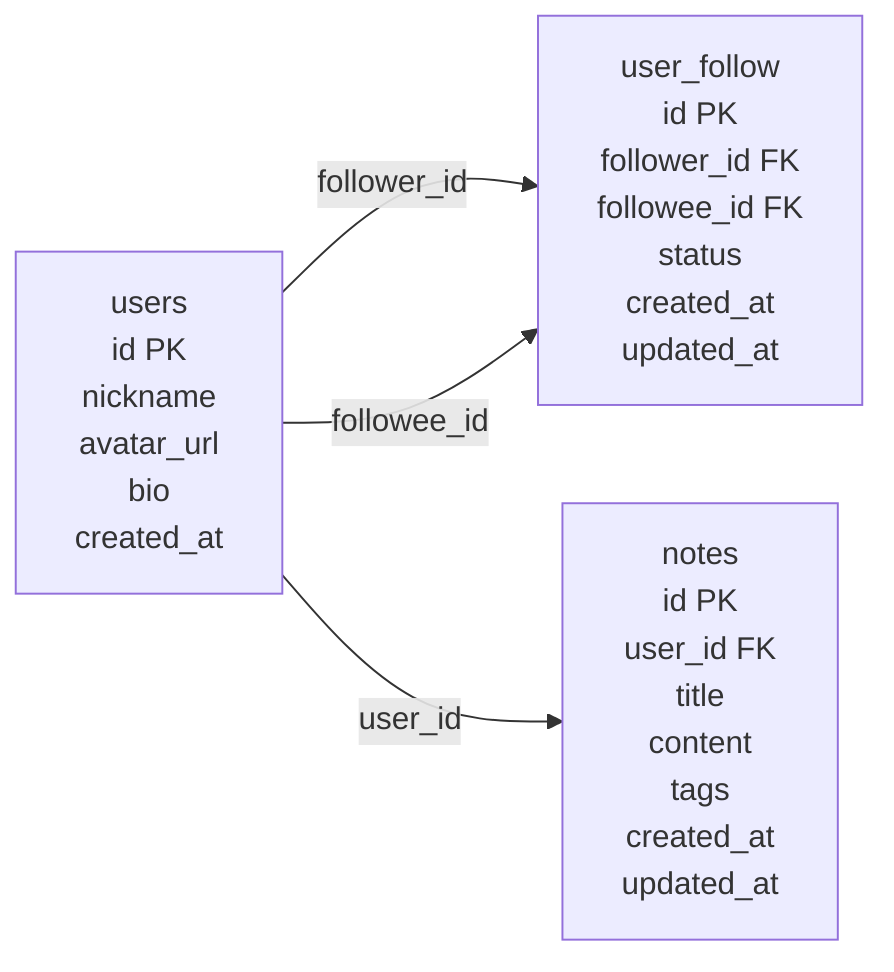

# XHS Lite Backend

一个模拟小红书核心社交场景的 Java 后端项目，面向后端实习作品集展示。项目基于 Spring Boot 3 和 Spring Data JPA 实现用户信息、关注关系和笔记搜索等基础能力，重点展示 RESTful API 设计、数据库建模、索引设计、统一异常处理、接口文档和单元测试覆盖。

## 在线演示

| 入口 | 地址 |
| --- | --- |
| 接口测试页 | http://152.136.231.179/xhs-test/ |
| Swagger UI | http://152.136.231.179/xhs/swagger-ui/index.html |
| 示例接口 | http://152.136.231.179/xhs/api/v1/users/1 |

## 项目概览

XHS Lite Backend 聚焦社交产品中最基础、也最容易体现后端工程能力的三类场景：

- 用户信息查询：按用户 ID 查询用户资料。
- 关注关系：关注、取关、关注列表、粉丝列表。
- 笔记搜索：按关键词分页搜索笔记。

项目默认使用 H2 内存数据库，拉取后可以直接启动演示；同时提供 MySQL 建表脚本，便于切换到更接近真实环境的数据库。

## 技术栈

| 类型 | 技术 |
| --- | --- |
| 后端框架 | Java 17, Spring Boot 3.5.6 |
| Web 能力 | Spring Web, Validation |
| 数据访问 | Spring Data JPA |
| 数据库 | H2, MySQL |
| 接口文档 | Springdoc OpenAPI / Swagger UI |
| 测试 | JUnit5, Mockito, JaCoCo |
| 构建工具 | Maven |

## 功能清单

| 模块 | 能力 |
| --- | --- |
| 用户模块 | 查询用户基础资料 |
| 关注模块 | 关注用户、取关用户、分页查询关注列表、分页查询粉丝列表 |
| 笔记模块 | 根据关键词分页搜索笔记 |
| 工程能力 | 统一响应体、全局异常处理、参数校验、Swagger 文档 |
| 测试保障 | Service 层单元测试、JaCoCo 覆盖率门槛 |

## 架构设计



分层说明：

- Controller：接收 HTTP 请求，完成路径参数、查询参数校验。
- Service：承载业务逻辑，包括关注关系校验、分页查询和搜索逻辑。
- Repository：基于 Spring Data JPA 访问用户、关注关系和笔记数据。
- Common / Config：提供统一返回体、错误码、全局异常处理和 OpenAPI 配置。

## 数据模型



关键约束与索引：

| 表 | 设计 |
| --- | --- |
| `user_follow` | 关注关系唯一约束，避免重复关注 |
| `user_follow` | `idx_follow_follower_status (follower_id, status)` 加速关注列表查询 |
| `user_follow` | `idx_follow_followee_status (followee_id, status)` 加速粉丝列表查询 |
| `notes` | `idx_notes_user_id (user_id)` 支持用户笔记关联 |
| `notes` | `idx_notes_created_at (created_at)` 支持按时间排序 |

## 本地启动

### 方式一：H2 快速演示

```bash
mvn spring-boot:run
```

启动后访问：

```text
Swagger UI: http://localhost:8080/swagger-ui/index.html
H2 Console: http://localhost:8080/h2-console
```

H2 默认会加载 `src/main/resources/db/h2-schema.sql` 和 `src/main/resources/db/h2-data.sql`，适合快速体验接口。

### 方式二：MySQL 运行

初始化数据库：

```bash
mysql -uroot -p < sql/01_init_xhs_lite.sql
```

使用 MySQL profile 启动：

```bash
mvn spring-boot:run -Dspring-boot.run.profiles=mysql
```

## 接口列表

| 方法 | 路径 | 说明 |
| --- | --- | --- |
| GET | `/api/v1/users/{userId}` | 查询用户信息 |
| POST | `/api/v1/users/{userId}/follow/{targetUserId}` | 关注用户 |
| DELETE | `/api/v1/users/{userId}/follow/{targetUserId}` | 取关用户 |
| GET | `/api/v1/users/{userId}/followees` | 分页查询关注列表 |
| GET | `/api/v1/users/{userId}/followers` | 分页查询粉丝列表 |
| GET | `/api/v1/notes/search` | 分页搜索笔记 |

## Curl 示例

查询用户：

```bash
curl -s http://localhost:8080/api/v1/users/1
```

关注用户：

```bash
curl -s -X POST http://localhost:8080/api/v1/users/1/follow/4
```

取关用户：

```bash
curl -s -X DELETE http://localhost:8080/api/v1/users/1/follow/4
```

查询关注列表：

```bash
curl -s "http://localhost:8080/api/v1/users/1/followees?page=0&size=10"
```

搜索笔记：

```bash
curl -s "http://localhost:8080/api/v1/notes/search?keyword=MySQL&page=0&size=10"
```

## 测试与覆盖率

运行测试：

```bash
mvn test
```

运行覆盖率校验：

```bash
mvn verify
```

覆盖率配置：

- 测试范围：`src/test/java/com/dane/xhslite/service`
- 覆盖率报告：`target/site/jacoco/index.html`
- JaCoCo 门槛：核心 Service 实现类行覆盖率 `LINE >= 70%`

## 项目结构

```text
xhs-lite-backend
├── sql
│   └── 01_init_xhs_lite.sql
└── src
    ├── main
    │   ├── java/com/dane/xhslite
    │   │   ├── common
    │   │   ├── config
    │   │   ├── controller
    │   │   ├── dto
    │   │   ├── entity
    │   │   ├── exception
    │   │   ├── repository
    │   │   └── service
    │   └── resources
    │       ├── application.yml
    │       ├── application-mysql.yml
    │       └── db
    └── test/java/com/dane/xhslite/service
```

## 项目亮点

- 使用 H2 + MySQL 双环境设计，兼顾本地快速演示和真实数据库建模。
- 通过关注关系唯一约束、自关注校验、复合索引和状态字段设计，提升关系查询效率与数据一致性。
- 统一返回体和全局异常处理覆盖 400、404、409、500 等常见错误场景，让接口行为更稳定。
- 使用 JUnit5、Mockito 和 JaCoCo 覆盖核心 Service 逻辑，保证业务规则可回归验证。
- 提供 Swagger UI、ER 图、架构图和 Curl 示例，方便面试展示和快速体验。
