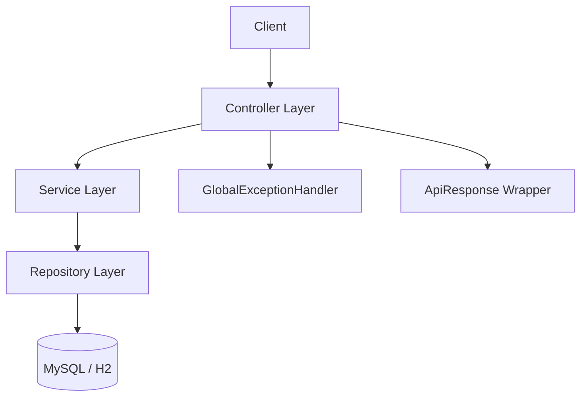
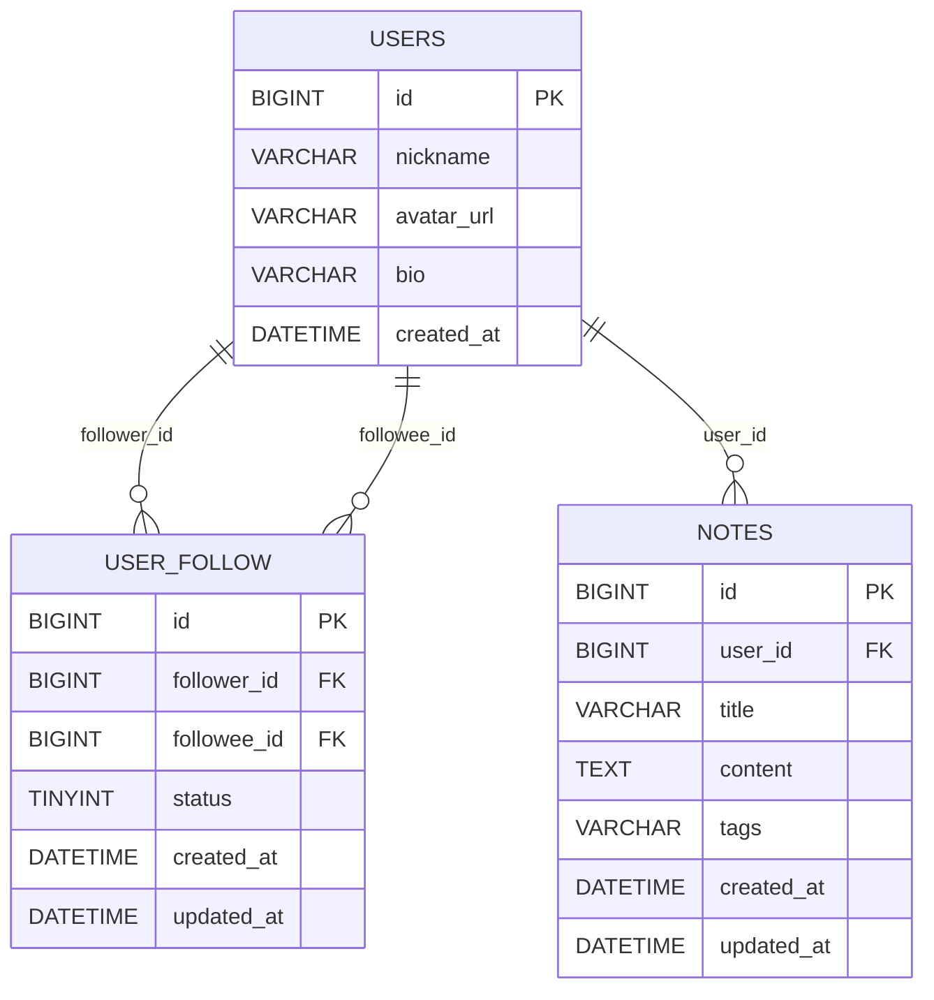

# xhs-lite-backend

面向后端实习投递的 Java Spring Boot 作品项目，模拟小红书风格核心后端场景：

- 用户信息查询
- 关注 / 取关
- 笔记搜索

项目重点展示：数据库建模与索引设计、统一异常处理、RESTful API、JUnit5 测试覆盖、Swagger 文档。

## 技术栈

- Java 17
- Spring Boot 3.5.6
- Spring Web + Validation
- Spring Data JPA
- MySQL（生产脚本）
- H2（默认本地运行）
- Springdoc OpenAPI（Swagger UI）
- JUnit5 + Mockito + JaCoCo

## 架构图



## ER 图



## MySQL 建表与索引

- 初始化脚本：`sql/01_init_xhs_lite.sql`
- 关键索引：
  - `idx_follow_follower_status (follower_id, status)`
  - `idx_follow_followee_status (followee_id, status)`
  - `idx_notes_user_id (user_id)`
  - `idx_notes_created_at (created_at)`

## 本地启动

### 方式 1：快速演示（默认 H2）

```bash
cd xhs-lite-backend
mvn spring-boot:run
```

访问：

- Swagger UI: `http://localhost:8080/swagger-ui/index.html`
- H2 Console: `http://localhost:8080/h2-console`

### 方式 2：连接 MySQL

1. 初始化数据库

```bash
mysql -uroot -p < sql/01_init_xhs_lite.sql
```

2. 使用 MySQL profile 启动

```bash
mvn spring-boot:run -Dspring-boot.run.profiles=mysql
```

## 接口示例

### 1) 查询用户信息

```bash
curl -s http://localhost:8080/api/v1/users/1
```

### 2) 关注用户

```bash
curl -s -X POST http://localhost:8080/api/v1/users/1/follow/4
```

### 3) 取关用户

```bash
curl -s -X DELETE http://localhost:8080/api/v1/users/1/follow/4
```

### 4) 查询关注列表

```bash
curl -s "http://localhost:8080/api/v1/users/1/followees?page=0&size=10"
```

### 5) 搜索笔记

```bash
curl -s "http://localhost:8080/api/v1/notes/search?keyword=MySQL&page=0&size=10"
```

## 测试与覆盖率

```bash
mvn verify
```

- 单元测试：`src/test/java/com/dane/xhslite/service`
- JaCoCo 报告：`target/site/jacoco/index.html`
- 覆盖率门槛：核心 service 实现类 `LINE >= 70%`

## 项目结构

```text
xhs-lite-backend
├── src/main/java/com/dane/xhslite
│   ├── common
│   ├── config
│   ├── controller
│   ├── dto
│   ├── entity
│   ├── exception
│   ├── repository
│   └── service
├── src/main/resources
│   ├── application.yml
│   ├── application-mysql.yml
│   └── db
├── src/test/java/com/dane/xhslite/service
└── sql/01_init_xhs_lite.sql
```
